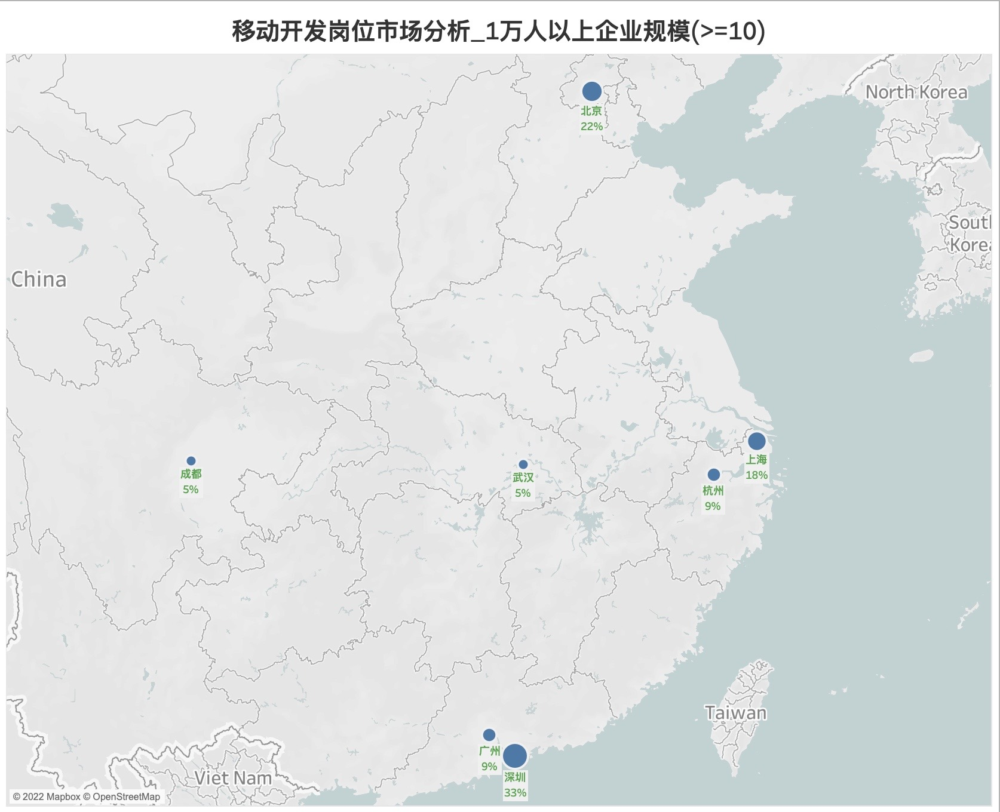
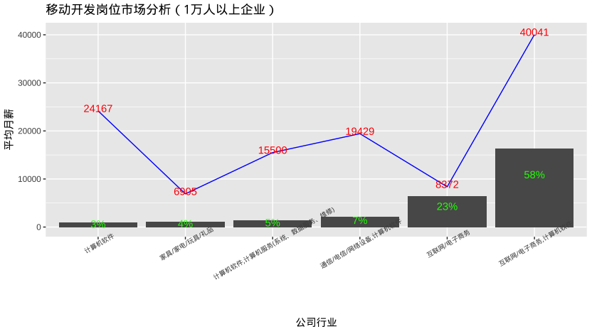
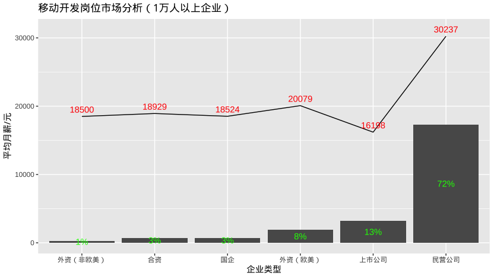
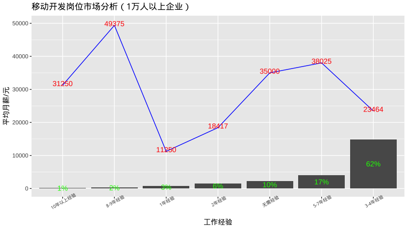
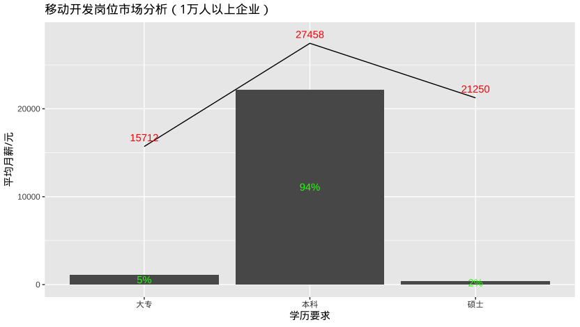

# 移动开发岗位招聘市场分析(1万人以上企业规模)

## 总述

本次采集有效数据1786条，主要分析目标为10000人以上企业规模的招聘需求和薪酬水平，形成数据241条。我们将从如下方面分析：

-   城市分布：岗位发布量至少10个，招聘需求主要活跃在北上深、其余城市虽有需求，但与前三者相比，仍有较大差距。

-   公司行业：主要以电商和计算机软件行业为主，占市场需求的89%。但平均月薪因行业不同差异巨大，如电商-\>8372元；软件-\>24167元；电商+软件-\>40041元。

-   公司类型：以民企为主，占市场需求的72%。相较于其他类型企业，民企的平均月薪可达3万，是各类型之首。

-   工作经验：62%的企业招聘要求平均经验3.5年，平均月薪23464元。另外，此岗位薪酬随着工作经验增加而增加。注意：无需经验通常为校招，平均月薪35000元主要来自字节跳动的岗位发布(业务如抖音移动、小荷健康、教育、游戏、飞书、小程序等)。

-   学历要求：以本科为主，占94%，平均月薪27458元。

-   工作简述：主要围绕的工作：熟练掌握和使用编程语言(Android/iOS/C/C++/web前端UI/java/javascript/dart/React等)，架构设计，软件开发，项目经验，调试和测试软件或应用程序，需求分析，多线程处理，沟通、团队合作、解决问题、形成技术文档等，偏好计算机专业人才。

## 城市分布

{width="661"}

## 公司行业

## 公司类型

## 工作经验

## 学历要求

## 工作简述

